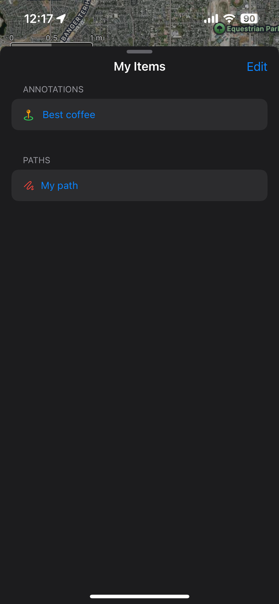

# TrekPoint

TrekPoint is an iOS mapping application focused on outdoor navigation and location tracking. It allows users to create and manage markers (annotations) and paths (polylines) on a map, with support for real-time location tracking.

## Features

### Map Interaction

- Interactive Map: Fully interactive map with hybrid view and realistic elevation
- Custom Map Controls: Compass and scale indicators for orientation
- Camera Controls: Easily navigate to user location or points of interest

### Marker Management

- Create Markers: Drop pins at specific coordinates with custom titles
- Edit Markers: Modify marker details and locations
- Drag & Drop: Intuitive dragging interface for precise pin placement

### Path Creation & Tracking

- Manual Path Drawing: Create paths by tapping points on the map
- Location Tracking: Record paths in real-time as you move
- Background Tracking: Continue tracking paths even when the app is in the background
- Session Recovery: Automatically restore tracking sessions if the app is closed

### Data Management

- Persistent Storage: All markers and paths are saved using SwiftData
- List View: Browse and manage all saved locations and paths
- Edit & Delete: Modify or remove saved items as needed

### User Experience

- Error Handling: Comprehensive error messages with toast notifications
- Gesture Controls: Intuitive gestures for map interaction and item manipulation
- Responsive UI: Adaptive interface that works across device sizes

## Technical Details

TrekPoint is built using:

- SwiftUI: For the user interface
- MapKit: For map rendering and interaction
- SwiftData: For persistent storage
- CoreLocation: For location services and tracking
- Background Tasks: For continued tracking when the app is in background

## Future Plans

The following features are planned:

High Priority:

- Refactoring to better decouple views and business logic

Medium Priority:

- Cache map tiles for offline use
- Settings page with customization options:
  - Map style (standard, satellite, hybrid, topographic)
  - Marker and paths styling options
  - Distance units and coordinate format preferences
  - GPS tracking sensitivity/battery optimization settings
  - Map overlay visibility options
  - Theme settings
- Search and sort functionality for markers and paths

Lower Priority:

- Photo/Video attachments for markers
- iCloud sync for cross-device usage
- Categorized markers (custom categories for different types of locations)

Unlikely to Implement (but interesting ideas):

- Stats dashboard (distance tracking, elevation changes, etc.)
- Live Activity support for tracking sessions
- Import/Export functionality (GPX format)
- Area calculation tool for measuring polygons
- Sharing map features via standard iOS share sheet

Very Unlikely to Implement:

- Elevation data display
- Weather integration
- Public land boundaries overlay

## Installation

1. Clone the repository
2. Open the project in Xcode 15+ (SwiftData requirement)
3. Build and run on iOS 17+ device or simulator

Alternatively, TrekPoint is [available through TestFlight](https://testflight.apple.com/join/kBRCsNMm)

## Requirements

- iOS 17.0+
- Xcode 15.0+
- Swift 5.9+

## Acknowledgements

- My good homie Caleb for inspiring me to create this project
